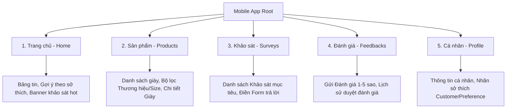

# 📱 BẢN THIẾT KẾ GIAO DIỆN & KIẾN TRÚC UI/UX MOBILE APP (CRM SHOES STORE)

> **Dự án:** CRM_ShoesStore  
> **Module:** Mobile Frontend (React Native / Expo Router)  
> **Ngày khởi tạo:** 17/09/2026  

---

## 🎨 1. Phối cảnh Giao diện Tổng quan (UI Mockup)

Bản thiết kế áp dụng phong cách Dark Mode hiện đại, màu sắc chủ đạo là Neon Cyan (`#00F2FE`) và Electric Violet (`#4FACFE`) tạo sự sang trọng, trẻ trung cho ứng dụng bán và chăm sóc khách hàng cửa hàng giày.

---

## 📱 2. Cấu trúc 5 Tab Điều Hướng Chính (Bottom Tab Bar)

Thanh điều hướng ở đáy ứng dụng bao gồm 5 Tab chính tương ứng với các nghiệp vụ CRM:



---

## 📋 3. Chi tiết Giao diện & Chức năng từng Tab

### 🏠 **Tab 1: Trang Chủ (`Home`)**
* **Header:**
  * Lời chào cá nhân hóa: *"Xin chào, [Tên Khách Hàng] 👋"*
  * Quả chuông thông báo (Thông báo có bài khảo sát mới hoặc chương trình tri ân).
* **Survey Banner Widget:**
  * Card hiển thị bài khảo sát CRM mới nhất được gán cho khách hàng kèm nút *"Tham gia ngay"*.
* **Bộ lọc Thương hiệu (Brand Slider):**
  * Các chip thương hiệu: Nike, Adidas, Jordan, Puma, New Balance.
* **Gợi ý theo Sở thích (Personalized Recommendations):**
  * Danh sách giày được lọc dựa trên các nhãn sở thích (`CustomerPreference`) của tài khoản.
* **Đánh giá Nổi bật (Top Reviews):**
  * Slider danh sách đánh giá 5 ⭐ từ các khách hàng khác.

---

### 👟 **Tab 2: Sản Phẩm (`Products`)**
* **Thanh Tìm kiếm & Bộ lọc (Search & Filter):**
  * Ô tìm kiếm theo tên sản phẩm.
  * Bộ lọc popup: Mức giá (`price`), Size, Màu sắc, Chất liệu, Thương hiệu (`brand`).
* **Danh sách Sản phẩm (Product Grid View):**
  * Card hiển thị: Hình ảnh sản phẩm (`imageUrl`), Tên sản phẩm (`productName`), Thương hiệu (`brand`), Giá (`price`), Tồn kho (`stockQuantity`).
* **Màn hình Chi tiết Sản phẩm (`product/[id].tsx`):**
  * Slide hình ảnh chi tiết.
  * Thông tin chất liệu, bảng chọn size.
  * Danh sách phản hồi & đánh giá thực tế từ khách hàng khác (`Feedback`).
  * Nút hành động: *"Viết Đánh Giá Cho Sản Phẩm Này"*.

---

### 📋 **Tab 3: Khảo Sát CRM (`Surveys`)**
* **Thanh chuyển trạng thái (Segmented Control):**
  * `Cần làm` (Danh sách khảo sát trong `SurveyTarget` chưa hoàn thành `isCompleted = false`).
  * `Đã hoàn thành` (Lịch sử bài khảo sát đã gửi).
* **Màn hình Điền Khảo Sát (`survey/[id].tsx`):**
  * Thanh tiến trình bài khảo sát (*Câu 2 / 5*).
  * **Hỗ trợ 3 loại câu hỏi theo Backend API:**
    1. `SINGLE_CHOICE`: Radio buttons chọn 1 đáp án hợp lệ.
    2. `MULTIPLE_CHOICE`: Checkboxes chọn nhiều đáp án.
    3. `TEXT`: Ô nhập nội dung ý kiến đóng góp tự do.
  * Nút *"Nộp bài khảo sát"* gửi dữ liệu về API `POST /api/surveys/:surveyId/submit`.

---

### ⭐ **Tab 4: Đánh Giá & Phản Hồi (`Feedbacks`)**
* **Màn hình Lịch sử Đánh giá:**
  * Danh sách các phản hồi khách hàng đã gửi kèm **Badges trạng thái duyệt**:
    * 🟡 `Pending` – Đang chờ Admin duyệt.
    * 🟢 `Approved` – Đã duyệt & hiển thị công khai.
* **Tạo Đánh Giá Mới (`feedback/create.tsx`):**
  * Form chọn sản phẩm đã mua.
  * Thanh chọn sao (Rating 1 - 5 ⭐).
  * Tiêu đề & Nội dung đánh giá.
  * Đính kèm hình ảnh trải nghiệm thực tế.

---

### 👤 **Tab 5: Cá Nhân & Sở Thích (`Profile`)**
* **Thẻ Hồ sơ (User Profile Card):**
  * Avatar, Họ tên (`fullName`), Số điện thoại, Email, Ngày sinh.
* **Quản lý Nhãn Sở Thích (`CustomerPreferences`):**
  * Giao diện chọn chip sở thích (VD: `#Sneaker`, `#ChạyBộ`, `#Đen`, `#DaThật`).
  * Tự động đồng bộ với Backend API `/api/preferences` để nhận gợi ý sản phẩm chính xác.
* **Tài khoản & Bảo mật:**
  * Đổi mật khẩu.
  * Đăng xuất.

---

## 📂 4. Cấu trúc Thư mục Code gợi ý (`mobile/src/app`)

Cấu trúc định tuyến File-based Routing với **Expo Router**:

```text
mobile/src/app/
├── _layout.tsx                 # Root Layout & Global Theme Provider
├── (auth)/                     # Flow Đăng ký / Đăng nhập
│   ├── login.tsx
│   └── register.tsx
├── (tabs)/                     # Main Bottom Navigation Tabs
│   ├── _layout.tsx             # Cấu hình 5 Icon Tab Bar
│   ├── index.tsx               # Tab 1: Home Screen
│   ├── products.tsx            # Tab 2: Products List Screen
│   ├── surveys.tsx             # Tab 3: Surveys List Screen
│   ├── feedbacks.tsx           # Tab 4: Feedbacks List Screen
│   └── profile.tsx             # Tab 5: User Profile Screen
├── product/
│   └── [id].tsx                # Chi tiết sản phẩm
├── survey/
│   └── [id].tsx                # Làm bài khảo sát
└── feedback/
    └── create.tsx              # Đánh giá sản phẩm mới
```

---

## 🔌 5. Danh sách API Backend Tương Ứng

| Tính năng | Phương thức HTTP | Route API Backend |
| :--- | :--- | :--- |
| Đăng nhập / Đăng ký | `POST` | `/api/accounts/login`, `/api/accounts/register` |
| Danh sách sản phẩm | `GET` | `/api/products` |
| Chi tiết sản phẩm | `GET` | `/api/products/:id` |
| Danh sách khảo sát được gán | `GET` | `/api/surveys/target/me` |
| Nộp bài khảo sát | `POST` | `/api/surveys/:surveyId/submit` |
| Gửi đánh giá sản phẩm | `POST` | `/api/feedbacks` |
| Lịch sử đánh giá cá nhân | `GET` | `/api/feedbacks/my-feedbacks` |
| Cập nhật nhãn sở thích | `POST` | `/api/preferences` |
